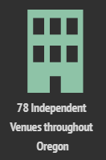
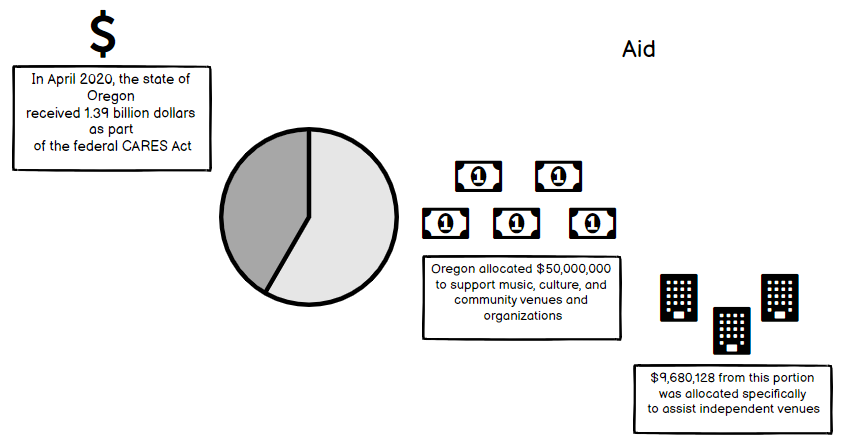
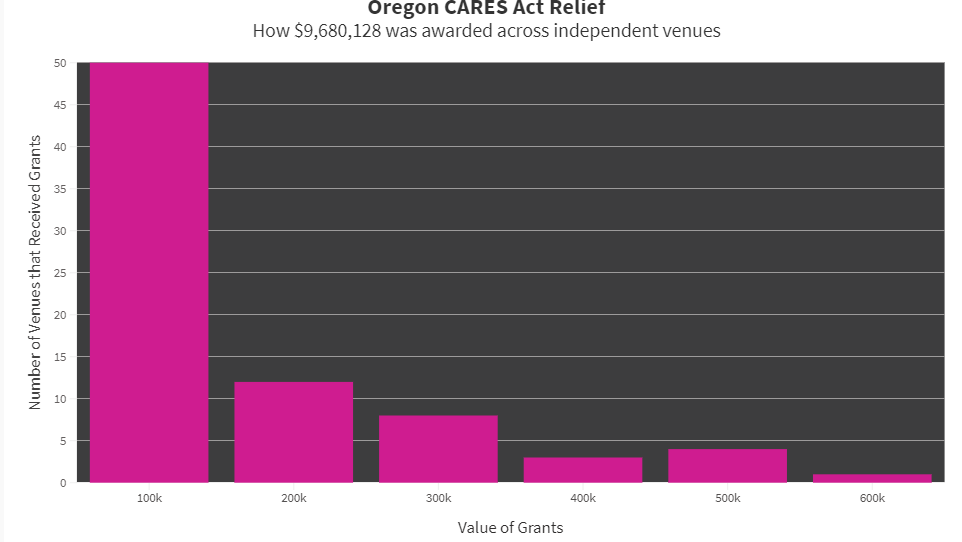
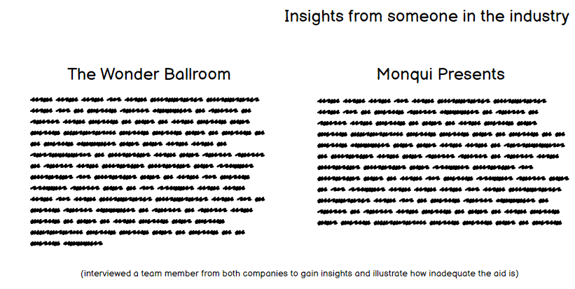
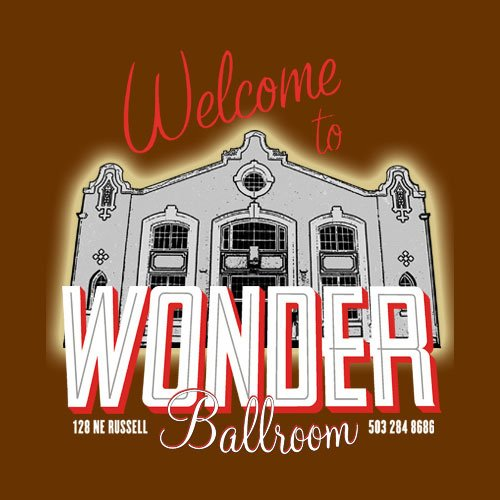
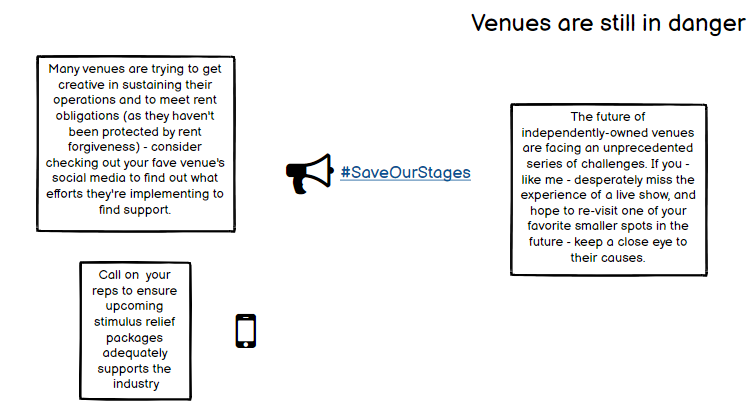

## Phase 1
###### Outline 

I want to convince my classmates that independently owned venues are in danger, but that they’re in a position to provide support. We’ve already lost many on a national level - by the time we can once again to concerts - there may be limited options. 

###### Sketches + Outline continued

###### Data Sources

National Independent Venue Association: advocating for congressional movement for a stimulus package to include protections for the industry, it will help to convey one of the call to actions for the community to support:
[Link](https://www.nivassoc.org/)

Pollstar projections of 2020’s missed revenues from live music due to COVID, this will illustrate the losses at a national level:
[Link](https://www.pollstar.com/article/pollstar-projects-2020-total-box-office-would-have-hit-122-billion-144197)

National Endowment for the Arts, in the opening of the story I’ll use some of these figures to indicate the proportion of the economy that the arts and entertainment industry makes up:
[Link](https://www.arts.gov/news/2020/during-economic-highs-and-lows-arts-are-key-segment-us-economy)

Independent Venue Coalition of Oregon, will provide figures illustrating the comparison numbers for events in Oregon (employees, customers, etc.):
[Link](https://www.voicevenues.com/)

Music Portland, conducted a survey among local (Portland) industry professionals that provides additional figures illustrating the situation here in Portland:
[Link](https://musicportland.org/lost-income)

PDXCares Venue Support Program, most recent care package to offer aid in Portland, provides the numbers associated with this package (September 2020):
[Link](https://musicportland.org/news-updates/2020/9/7/pdxcares-venue-support-program-now-accepting-applications-10-50k-grants-for-venues)

Local Portland publication in May regarding initial calls for assistance (provides $$ loss for Ticket Tomato, an Portland-based ticket seller -another casualty of the losses):
[Link](https://www.oregonlive.com/coronavirus/2020/05/oregons-live-events-industry-says-it-needs-more-help-to-survive-coronavirus-shutdown.html)

Southwest examiner, venue relief approved by the emergency board in July 2020 (and how this package still didn’t meet their needs):
[Link](https://www.southeastexaminer.com/2020/07/venue-relief-approved-by-emergency-board/)

National Independent Venue Association summary of the current situation: 
[Link](https://static1.squarespace.com/static/5e91157c96fe495a4baf48f2/t/5edef4ab8d0d2c0d8e9fb8cb/1591669933173/NIVA-+Policy+and+Fact+Sheet.pdf)

Chicago Loop Alliance Impact Study of the arts (while it references Chicago, it provides figures regarding the broader economic impacts the arts have on the entire community and other industries - illustrates the much larger implications of “only” losing venues):
[Link](https://loopchicago.com/assets/f4fdbc1e00/Arts-in-the-Loop-Study.pdf)

###### Completing the project

Moving forward, I’ll be working more directly with both Shorthand and Tableau in order to use them more effectively for the final product. 
As the majority of this information are statistics, I’ll also be utilizing infogram in order to create an effective series of infographics for these data points. 
I’ll be creating visuals on tableau for broader data that is not specific to Portland (arts and entertainment proportion of national GDP), as well as 
initial figures for impacts across industries from COVID-19. Additionally, I’ll be creating my own simple data sets by collecting data on the following topics: 
total number of independent venues in Portland operating before March 2020, total number of independent venues that haven’t been forced to vacate the premises 
as of 10/1/2020, strategies they’ve utilized to raise funds, and other relevant points that are available and discovered during my initial searches. 
Additionally, I’ll be conducting a short interview with a staff member of a local promotional outlet, to learn about the impacts his company has directly experienced.

Shorthand will be my medium of choice for the final project, with a focus on Portland, Oregon, yet expanding to include national figures and references as it 
is a nationwide issue. I’ll refer to other resources such as FontJoy.com and the Good Charts text to guide me in making a persuasive and refined virtual 
presentation of my topic. 

## Phase 2

###### User Research Protocol

User Research Protocol

Who do I want to reach?
I hope to reach anyone that misses going to non-arena-sized events. Anyone that’s looking forward to going to an event (be it music-based or not) once it’s established as safe enough to do so - where you’ll be surrounded by people that get excited over that same thing you’re excited about.

User research population?
I wanted to discuss my rough wireframes and visuals with individuals that are either 1) folks that I know for a fact miss live music, and 2) aren’t necessarily invested in that scene and may not even go to many concerts in general. 

Interview Questions:
What was the story you gathered while scrolling?

I know it was a little haphazard, but were you still able to make sense of the flow of content? What kind of changes would you recommend?

Is there anything you would change about the ordering of information?

I know not all of my data visuals were included (several were in text) - aside from those points - what am I missing?

I didn’t have a chance to include the info on the “insights” wireframe to illustrate why the aid listed above was insufficient - when I include this do you think it’ll help complete the story? If not - what else do you need to know?

I plan on using a dark background for the shorthand page - to match the venue/show photos spread throughout the storyboard - do you think this matches the mood of the story?

What colors -if any- would you like to see more of as part of the story?
Anything else?

###### Findings from interviews:
Understood the story I was trying to deliver: “Live music is a much bigger source of revenue than I had imagined, so it’s really important that we save our stages - not just for the experience that is live music, but for the economy and state as a whole.” 

However, I need to clarify the current status of associated employees within the industry: “a little unsure if community local business will be enough to save them - unsure if staff are still getting paid or unemployed.” I also need to provide more clarity on the final data visualizations that I provide - my use of some graph icons as placeholders was confusing since they weren’t really presenting anything - so I’ll need to be sure that no assumptions are made.
Was able to understand the flow of the of the content: “I was able to make sense of the flow of the content.” and “the ordering made sense” as well as “I thought it was really clear.” - so no recommendation to re-arrange the delivery. 

Regarding the incomplete frame for the “insights” section that will provide a first-hand account of why the conflict is ongoing: “I definitely think it will help the story when you include it because right now the aid that venues received seems like a lot.” Additionally, it’s requested that other info be shared such as number of venues permanently closed, and how long venues can expect to continue on while employing their staff? I’ll make sure to include a national total as I believe one of my sources has been keeping track of this; the second recommendation may be difficult to find but I’ll make a search for it. 

Regarding the use of darker colors/a darker background seems to be fitting: “I think it fits - especially since the story is a bit bleak.” Also heard general feedback about just making sure that color don’t bleed into one another, and also positively received the bright neon colors some of my photos included - I’ll try to keep a close eye on incorporating this as I agree that it would be a great way to punch up the dark background while tying back to the photos. 

Some input was provided regarding what else to include on the page - in terms of visuals: “Maybe some images of tech crews and people who work behind the scenes at the venues - it can show folks how many people are involved in producing a show.” And there was also appreciation for the inclusion of the venue photos: “It brings them to life and drums up a memory of an event. I’d add a photo of someone working for a more humanizing connection.” Given this feedback, I’ll expand my photo search to reflect the people behind and in front of the scenes as well - those that are being impacted by the story. 

Extra feedback: “for text blocks - you should left-align to help users read long blocks of text more easily.” Another user indicated that they really felt that it is an issue that’s important to me - they only addition is that I include a specific resource on how to help the cause; this is something I’m sorely missing - so I certainly plan on wrapping up the project with a specific site/org that interested parties can visit. 

## Phase 3

I tried to deliver a story that was approachable to individuals that sorely miss experiencing live music, folks that fans of arts and entertainment, and others that may simply be interested in various impacts of the pandemic. As one of the critics noted last week, it is likely not going to be an impartial perspective; I’m guessing that my personal love of concerts will be made clear. I tried to create a more human connection by including photos of venues that are located here in Portland to break up the generic ones from free stock photo image banks, as well as a few photos with people in them to illustrate the different jobs involved in putting on a show. I didn’t use any personas while putting together the final project – instead I just reevaluated the data I had gathered up and selected the pieces I thought would provide the most cohesive story. 

Getting data was actually the most challenging aspect of the project since it isn’t over; things are constantly changing, and the information I did find was either super concentrated in one state, or super vague and referencing several industries at once. I had to create simple data sets from websites in order create several data visualizations; examples of those online sources include a website that tracked Oregon independent venues and a memo from Oregon State Legislature. Again, since it is an ongoing situation, there are details I couldn’t get ahold of that I think would have made helpful contributions to the storyline, such as the number of jobs lost specifically within the concert industry. Not across arts and creatives as a whole; I did find some numbers for this, but that would be far too broad to apply in this context. 

Visually, I wanted to make it feel like you were going to go to a concert; so, you start from outside of the building. You make your way inside and there’s your crowd and all the lights. Transitioning into talking about the pandemic, I wanted to give a literal presentation of empty stages; if used correctly, it should make the audience realize that unless action is taken – many of these may remain empty – even when it is safe to go back. The color scheme I used for the visuals were mainly based off of the first empty stage photo I included in Shorthand – from the Doug Fir Lounge; I like the bright neon colors, and think they adequately recall the lighting you often see when you’re at an entertainment event – like a concert. 
