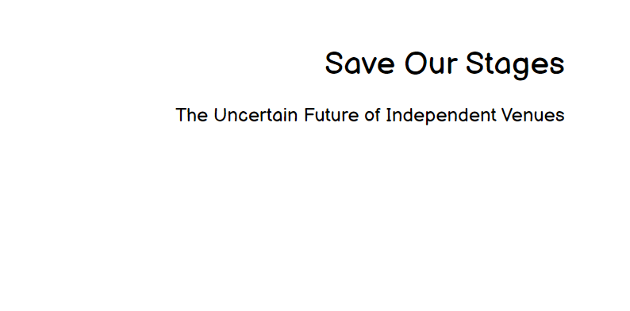
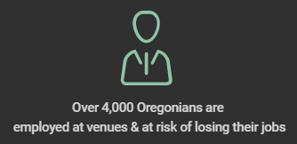
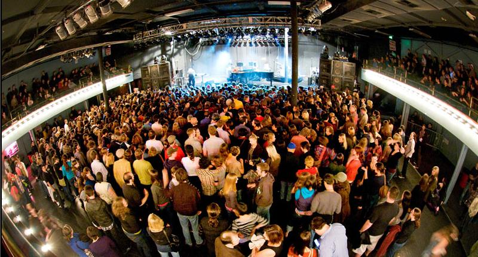

## Phase 1
###### Outline 

I want to convince my classmates that independently owned venues are in danger, but that they’re in a position to provide support. We’ve already lost many on a national level - by the time we can once again to concerts - there may be limited options. 

###### Sketches + Outline continued

###### Data Sources

National Independent Venue Association: advocating for congressional movement for a stimulus package to include protections for the industry, it will help to convey one of the call to actions for the community to support:
[Link](https://www.nivassoc.org/)

Pollstar projections of 2020’s missed revenues from live music due to COVID, this will illustrate the losses at a national level:
[Link](https://www.pollstar.com/article/pollstar-projects-2020-total-box-office-would-have-hit-122-billion-144197)

National Endowment for the Arts, in the opening of the story I’ll use some of these figures to indicate the proportion of the economy that the arts and entertainment industry makes up:
[Link](https://www.arts.gov/news/2020/during-economic-highs-and-lows-arts-are-key-segment-us-economy)

Independent Venue Coalition of Oregon, will provide figures illustrating the comparison numbers for events in Oregon (employees, customers, etc.):
[Link](https://www.voicevenues.com/)

Music Portland, conducted a survey among local (Portland) industry professionals that provides additional figures illustrating the situation here in Portland:
[Link](https://musicportland.org/lost-income)

PDXCares Venue Support Program, most recent care package to offer aid in Portland, provides the numbers associated with this package (September 2020):
[Link](https://musicportland.org/news-updates/2020/9/7/pdxcares-venue-support-program-now-accepting-applications-10-50k-grants-for-venues)

Local Portland publication in May regarding initial calls for assistance (provides $$ loss for Ticket Tomato, an Portland-based ticket seller -another casualty of the losses):
[Link](https://www.oregonlive.com/coronavirus/2020/05/oregons-live-events-industry-says-it-needs-more-help-to-survive-coronavirus-shutdown.html)

Southwest examiner, venue relief approved by the emergency board in July 2020 (and how this package still didn’t meet their needs):
[Link](https://www.southeastexaminer.com/2020/07/venue-relief-approved-by-emergency-board/)

National Independent Venue Association summary of the current situation: 
[Link](https://static1.squarespace.com/static/5e91157c96fe495a4baf48f2/t/5edef4ab8d0d2c0d8e9fb8cb/1591669933173/NIVA-+Policy+and+Fact+Sheet.pdf)

Chicago Loop Alliance Impact Study of the arts (while it references Chicago, it provides figures regarding the broader economic impacts the arts have on the entire community and other industries - illustrates the much larger implications of “only” losing venues):
[Link](https://loopchicago.com/assets/f4fdbc1e00/Arts-in-the-Loop-Study.pdf)

###### Completing the project

Moving forward, I’ll be working more directly with both Shorthand and Tableau in order to use them more effectively for the final product. 
As the majority of this information are statistics, I’ll also be utilizing infogram in order to create an effective series of infographics for these data points. 
I’ll be creating visuals on tableau for broader data that is not specific to Portland (arts and entertainment proportion of national GDP), as well as 
initial figures for impacts across industries from COVID-19. Additionally, I’ll be creating my own simple data sets by collecting data on the following topics: 
total number of independent venues in Portland operating before March 2020, total number of independent venues that haven’t been forced to vacate the premises 
as of 10/1/2020, strategies they’ve utilized to raise funds, and other relevant points that are available and discovered during my initial searches. 
Additionally, I’ll be conducting a short interview with a staff member of a local promotional outlet, to learn about the impacts his company has directly experienced.

Shorthand will be my medium of choice for the final project, with a focus on Portland, Oregon, yet expanding to include national figures and references as it 
is a nationwide issue. I’ll refer to other resources such as FontJoy.com and the Good Charts text to guide me in making a persuasive and refined virtual 
presentation of my topic. 

## Phase 2

